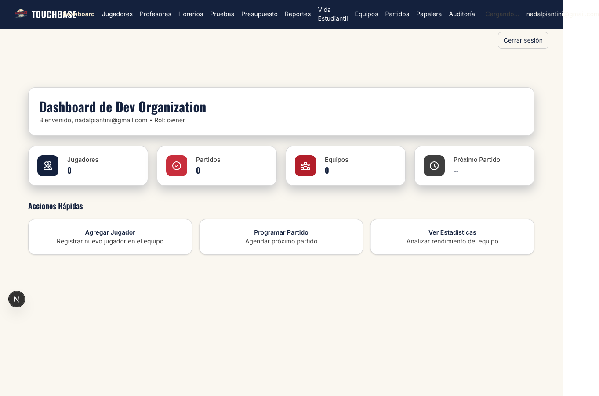
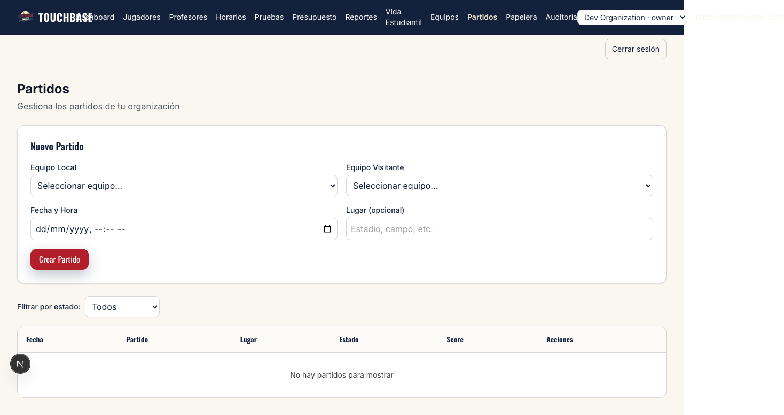

# Informe de Exploración: Sección "Ligas" y Jugadores Ficticios

**Fecha:** 2025-12-20  
**Investigador:** Claude Code con Playwright  
**Usuario de prueba:** nadalpiantini@gmail.com

---

## 🎯 Objetivo de la Investigación

Explorar la sección de "Ligas" en la aplicación web y verificar si existen jugadores ficticios con jugadas creadas en commits anteriores.

---

## 🔍 Hallazgos Principales

### 1. Frontend (Web UI)

#### ✅ Navegación Actual
La aplicación tiene las siguientes secciones en el dashboard:
- Dashboard
- Jugadores
- Profesores
- Horarios
- Pruebas
- Presupuesto
- Reportes
- Vida Estudiantil
- Equipos
- **Partidos** (`/es/dashboard/games`)
- Papelera
- Auditoría

#### ❌ Sección "Ligas" NO Existe
- **No hay** una sección específica llamada "Ligas" o "Torneos" en la navegación
- **No hay** traducciones para "liga" o "league" en los archivos de i18n (excepto en privacy policy)
- **No hay** componentes de UI para torneos/ligas
- **No hay** endpoints de API para `/api/tournaments`, `/api/matches`, `/api/standings`, `/api/ligas`

#### ✅ Sección "Partidos" Existe
Ubicación: `/es/dashboard/games`

**Funcionalidad actual:**
- Formulario para crear partidos individuales
  - Equipo Local (select)
  - Equipo Visitante (select)
  - Fecha y Hora
  - Lugar (opcional)
- Tabla de partidos con:
  - Filtros por estado: Todos, Programados, En Vivo, Finalizados, Cancelados
  - Edición de scores en tiempo real
  - Cambio de estado de partidos
  - Eliminación suave de partidos

**Limitaciones:**
- Solo maneja partidos individuales, NO torneos/ligas
- No hay concepto de ronda, bracket, clasificación
- No está conectado a la tabla `touchbase_matches` (usa `touchbase_games`)

---

### 2. Base de Datos (Supabase/PostgreSQL)

#### ✅ Migración de Torneos Aplicada Parcialmente
Archivo: `/migrations/postgres/004_tournaments.sql`

**Tablas creadas:**
- `touchbase_tournaments` - Torneos
- `touchbase_tournament_teams` - Equipos en torneos
- `touchbase_matches` - Partidos de torneos

**Estado actual:**
```
📊 Torneos: 1 (Spring Championship 2025)
   - Formato: round_robin
   - Estado: scheduled
   - Inicio: 2025-03-01
   - Fin: 2025-05-31

🏆 Equipos en torneo: 0 (vacío)

⚾ Matches de torneo: 0 (vacío)

🎮 Games regulares: 0 (vacío)

❌ Vista touchbase_standings: NO EXISTE (error SQL)
```

**Problema identificado:**
- La vista `touchbase_standings` definida en la migración NO fue creada correctamente
- Esto impide calcular clasificaciones automáticamente

---

### 3. Jugadores Ficticios

#### ❌ NO se encontraron jugadores ficticios con jugadas

**Búsqueda realizada:**
- Commits de los últimos 7 días
- Archivos de migraciones
- Scripts de seed
- Tablas de base de datos

**Commits relevantes encontrados:**
- `feat(games): Sprint 4 - matches/scoreboard system with full CRUD`
- `fix(migrations): consolidate games migrations into single idempotent file`
- `feat: implement complete player registration wizard`
- `feat(export): Add CSV export functionality for players, teachers, and classes`

**Conclusión:**
- Se crearon estructuras para gestionar partidos y jugadores
- NO se crearon datos de prueba (fixtures/seeds) con jugadores ficticios y sus jugadas
- La funcionalidad existe pero NO hay datos de ejemplo

---

## 📊 Análisis de Arquitectura

### Dualidad de Sistemas de Partidos

El proyecto tiene **DOS sistemas paralelos** para gestionar partidos:

#### Sistema 1: Games (Actual, Implementado)
- **Frontend:** `/app/[locale]/(protected)/dashboard/games/`
- **Componentes:** `GamesNewForm`, `GamesTable`
- **API:** `/api/games/list`, `/api/games/update-score`, `/api/games/status`, `/api/games/soft-delete`
- **Tabla DB:** `touchbase_games`
- **Alcance:** Partidos individuales, sin concepto de torneo

#### Sistema 2: Tournaments (Migrado, NO Implementado)
- **Frontend:** ❌ No existe
- **Componentes:** ❌ No existen
- **API:** ❌ No existe
- **Tablas DB:** ✅ `touchbase_tournaments`, `touchbase_tournament_teams`, `touchbase_matches`
- **Vista DB:** ❌ `touchbase_standings` (fallo en creación)
- **Alcance:** Torneos completos, brackets, clasificaciones

---

## 🚨 Problemas Detectados

1. **Vista de Standings no creada**
   - La vista `touchbase_standings` definida en `004_tournaments.sql` NO existe
   - Error: `relation "public.touchbase_standings" does not exist`
   - Causa probable: Error en la migración o no se ejecutó completamente

2. **Desconexión Frontend-Backend**
   - Existe infraestructura de torneos en DB pero NO en el frontend
   - No hay forma de:
     - Crear torneos desde la UI
     - Asignar equipos a torneos
     - Generar matches de torneo
     - Ver clasificaciones (standings)

3. **Falta de Datos de Prueba**
   - No hay jugadores ficticios
   - No hay partidos de ejemplo
   - No hay datos de torneos completos
   - Dificulta pruebas y demostración

---

## 📸 Evidencia (Screenshots)

### Dashboard después del login


### Sección de Partidos


**Observaciones:**
- Formulario de creación de partidos visible
- Filtros de estado disponibles
- Tabla vacía (sin datos de partidos)
- NO hay mención a "Ligas", "Torneos" o "Clasificaciones"

---

## 💡 Recomendaciones

### Opción 1: Implementar Funcionalidad de Torneos/Ligas
1. Crear componentes de UI para torneos
2. Crear endpoints de API para torneos
3. Integrar con tablas existentes de torneos
4. Corregir vista de standings
5. Crear datos de prueba

### Opción 2: Simplificar y Usar Solo Games
1. Eliminar migraciones de torneos (004_tournaments.sql)
2. Enfocarse solo en `touchbase_games`
3. Agregar campo `league_id` a `touchbase_games` si es necesario
4. Calcular clasificaciones con queries simples

### Opción 3: Migrar Games a Tournaments
1. Deprecar tabla `touchbase_games`
2. Migrar funcionalidad actual a `touchbase_matches`
3. Implementar UI de torneos
4. Mantener solo un sistema

---

## 🧪 Tests Creados

### 1. `tests/explore-leagues.spec.ts`
- Login con credenciales del usuario
- Búsqueda de sección "Ligas" en navegación
- Verificación de existencia de endpoints de API
- Captura de screenshots

### 2. `tests/explore-partidos.spec.ts`
- Login y navegación a sección "Partidos"
- Análisis de contenido de la página
- Captura de screenshots

### 3. `scripts/check-tournaments.ts`
- Verificación de datos en tablas de torneos
- Verificación de datos en tablas de games
- Intento de lectura de vista de standings

---

## ✅ Conclusión

**NO existe** una sección de "Ligas" en el frontend actual.

**Existe** la infraestructura de base de datos para torneos, pero:
- No está conectada al frontend
- Tiene problemas (vista de standings no creada)
- No tiene datos de prueba

**NO existen** jugadores ficticios con jugadas creadas en commits anteriores.

**Recomendación inmediata:**
1. Decidir qué sistema usar (Games vs Tournaments)
2. Corregir la migración de standings si se elige Tournaments
3. Crear datos de prueba para facilitar desarrollo y QA

---

**Investigación completada con éxito** ✅
