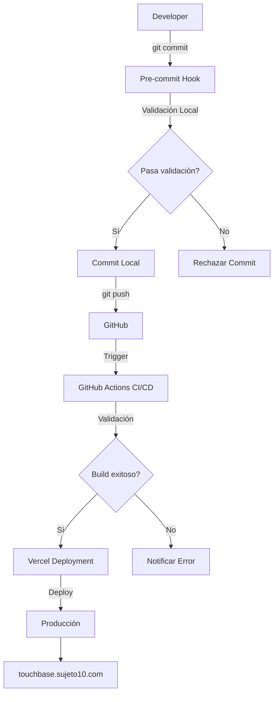

# 🚀 TouchBase Deployment Flow Documentation

## Índice
1. [Resumen](#resumen)
2. [Arquitectura del Flujo](#arquitectura-del-flujo)
3. [Componentes del Sistema](#componentes-del-sistema)
4. [Flujos de Deployment](#flujos-de-deployment)
5. [Comandos Útiles](#comandos-útiles)
6. [Configuración Inicial](#configuración-inicial)
7. [Troubleshooting](#troubleshooting)
8. [Rollback y Recuperación](#rollback-y-recuperación)

---

## Resumen

El flujo de deployment de TouchBase está diseñado para ser **robusto**, **automatizado** y **seguro**, con múltiples capas de validación antes de que el código llegue a producción.

### Características Principales
- ✅ **Validación en múltiples niveles**: local, CI/CD, y pre-deploy
- 🔄 **Deployment automatizado**: Push to master → Deploy automático
- 🛡️ **Protección contra errores**: Pre-commit hooks y validaciones
- 📊 **Visibilidad completa**: Logs y reportes en cada paso
- 🔧 **Fácil rollback**: Versionado en Vercel para reversión rápida

---

## Arquitectura del Flujo



---

## Componentes del Sistema

### 1. Scripts Locales

#### `scripts/deploy.sh`
Script principal para deployment manual con todas las validaciones.

**Características:**
- Validación completa pre-deploy
- Build local de verificación
- Deploy directo a Vercel
- Rollback automático si falla

**Uso:**
```bash
./scripts/deploy.sh              # Deploy normal
./scripts/deploy.sh --skip-tests # Omitir tests
./scripts/deploy.sh --force      # Forzar deploy
```

#### `scripts/validate-deploy.sh`
Validación exhaustiva del estado del proyecto antes del deployment.

**Validaciones:**
- Variables de entorno
- Estado de Git
- Dependencias
- Calidad del código
- Configuración de Vercel
- Conexión con Supabase

**Uso:**
```bash
./scripts/validate-deploy.sh
```

### 2. Git Hooks

#### `.git/hooks/pre-commit`
Hook automático que valida el código antes de cada commit.

**Validaciones:**
- ESLint
- TypeScript compilation
- Detección de console.logs
- Archivos sensibles (.env, keys)
- Tamaño de archivos

### 3. GitHub Actions

#### `.github/workflows/deploy.yml`
Pipeline completo de CI/CD para deployment automático.

**Stages:**
1. **Validate**: Verifica cambios en `web/`
2. **Code Quality**: ESLint y TypeScript
3. **Build Check**: Compilación de Next.js
4. **Tests**: E2E tests (opcional)
5. **Deploy**: Deployment a Vercel
6. **Notify**: Notificación de estado

#### `.github/workflows/ci.yml`
Pipeline de integración continua para PRs.

**Validaciones:**
- Linting
- Build verification
- Tests

### 4. Configuración de Vercel

#### `vercel.json`
Configuración optimizada para Next.js con:
- Build commands específicos
- Ignore command para evitar rebuilds innecesarios
- Configuración de regiones
- Headers de seguridad
- Auto-deploy desde master/main

---

## Flujos de Deployment

### 🟢 Flujo Automático (Recomendado)

1. **Desarrollo local**
   ```bash
   cd web
   npm run dev
   ```

2. **Commit con validación automática**
   ```bash
   git add .
   git commit -m "feat: nueva funcionalidad"
   # Hook pre-commit se ejecuta automáticamente
   ```

3. **Push a master**
   ```bash
   git push origin master
   ```

4. **GitHub Actions se activa**
   - Ejecuta validaciones
   - Build de verificación
   - Deploy automático a Vercel

5. **Verificación**
   - Check deployment en: https://touchbase.sujeto10.com

### 🔵 Flujo Manual (Control Total)

1. **Validación pre-deploy**
   ```bash
   ./scripts/validate-deploy.sh
   ```

2. **Deploy manual**
   ```bash
   ./scripts/deploy.sh
   ```

3. **Verificación**
   ```bash
   curl -I https://touchbase.sujeto10.com
   ```

### 🟡 Flujo de Emergencia

Para deployments urgentes saltando validaciones:

```bash
# Saltar tests pero mantener validaciones críticas
./scripts/deploy.sh --skip-tests

# Forzar deploy (NO recomendado)
./scripts/deploy.sh --force
```

---

## Comandos Útiles

### Comandos de Desarrollo

```bash
# Desarrollo local
cd web && npm run dev

# Verificar TypeScript
cd web && npx tsc --noEmit

# Ejecutar linting
cd web && npm run lint

# Build local
cd web && npm run build

# Tests E2E
npm run test:e2e
```

### Comandos de Deployment

```bash
# Validar estado del proyecto
./scripts/validate-deploy.sh

# Deploy completo
./scripts/deploy.sh

# Ver estado en Vercel
vercel ls

# Ver logs del último deployment
vercel logs

# Inspeccionar deployment específico
vercel inspect [deployment-url]
```

### Comandos de Git

```bash
# Ver estado
git status

# Ver branch actual
git branch --show-current

# Sincronizar con remoto
git pull origin master

# Ver últimos commits
git log --oneline -10

# Revertir último commit (si no se ha pusheado)
git reset --soft HEAD~1
```

---

## Configuración Inicial

### 1. Instalar Dependencias

```bash
# En el root del proyecto
cd web
npm install

# Instalar Vercel CLI globalmente
npm install -g vercel
```

### 2. Configurar Variables de Entorno

Crear archivo `web/.env.local`:
```env
NEXT_PUBLIC_SUPABASE_URL=tu_url_de_supabase
NEXT_PUBLIC_SUPABASE_ANON_KEY=tu_anon_key
```

### 3. Vincular con Vercel

```bash
vercel link
# Seguir las instrucciones para vincular el proyecto
```

### 4. Configurar GitHub Secrets

En GitHub → Settings → Secrets, agregar:
- `VERCEL_TOKEN`
- `VERCEL_ORG_ID`
- `VERCEL_PROJECT_ID`
- `NEXT_PUBLIC_SUPABASE_URL`
- `NEXT_PUBLIC_SUPABASE_ANON_KEY`

### 5. Activar Git Hooks

El hook pre-commit ya está configurado y activo.

---

## Troubleshooting

### Problema: Build falla localmente

**Síntomas:** `npm run build` falla con errores de TypeScript

**Solución:**
```bash
# Limpiar cache
rm -rf web/.next
rm -rf web/node_modules

# Reinstalar
cd web
npm ci

# Verificar TypeScript
npx tsc --noEmit
```

### Problema: Deploy falla en Vercel

**Síntomas:** GitHub Actions pasa pero Vercel falla

**Solución:**
```bash
# Ver logs de Vercel
vercel logs

# Verificar configuración
cat vercel.json

# Re-vincular proyecto
vercel link --yes
```

### Problema: Variables de entorno no funcionan

**Síntomas:** Errores de Supabase en producción

**Solución:**
1. Verificar en Vercel Dashboard → Settings → Environment Variables
2. Asegurarse de que están configuradas para Production
3. Re-deploy:
   ```bash
   vercel --prod --force
   ```

### Problema: Pre-commit hook no se ejecuta

**Síntomas:** Commits se hacen sin validación

**Solución:**
```bash
# Verificar que el hook existe y es ejecutable
ls -la .git/hooks/pre-commit
chmod +x .git/hooks/pre-commit

# Si usa un GUI de Git, puede necesitar configurar:
git config core.hooksPath .git/hooks
```

### Problema: GitHub Actions no se ejecuta

**Síntomas:** Push a master no dispara el workflow

**Solución:**
1. Verificar que el workflow está en `.github/workflows/`
2. Verificar permisos en GitHub → Settings → Actions
3. Verificar logs en GitHub → Actions tab

---

## Rollback y Recuperación

### Rollback Rápido en Vercel

```bash
# Ver deployments anteriores
vercel ls

# Promover deployment anterior a producción
vercel promote [deployment-url]

# O desde el dashboard de Vercel:
# 1. Ir a proyecto → Deployments
# 2. Encontrar deployment estable
# 3. Click en "..." → "Promote to Production"
```

### Rollback con Git

```bash
# Revertir último commit
git revert HEAD
git push origin master

# Revertir a commit específico
git reset --hard [commit-hash]
git push --force origin master  # CUIDADO: esto reescribe historia
```

### Recuperación de Emergencia

Si todo falla:

1. **Backup del código estable**
   ```bash
   git checkout [último-commit-estable]
   git checkout -b emergency-fix
   ```

2. **Fix rápido**
   ```bash
   # Hacer cambios necesarios
   git add .
   git commit -m "emergency: fix crítico"
   ```

3. **Deploy directo**
   ```bash
   vercel --prod --yes
   ```

4. **Merge back cuando esté estable**
   ```bash
   git checkout master
   git merge emergency-fix
   git push origin master
   ```

---

## Mejores Prácticas

### ✅ DO's
- Siempre ejecutar `./scripts/validate-deploy.sh` antes de deployments importantes
- Mantener `master` branch siempre deployable
- Usar feature branches para desarrollo
- Escribir mensajes de commit descriptivos
- Monitorear deployments después de push

### ❌ DON'Ts
- No hacer force push a master
- No saltear validaciones sin razón válida
- No commitear archivos `.env` o secretos
- No deployar con errores de TypeScript
- No ignorar warnings de ESLint consistentemente

---

## Contacto y Soporte

Para problemas con el deployment:

1. Revisar esta documentación
2. Verificar logs en GitHub Actions
3. Verificar dashboard de Vercel
4. Contactar al equipo de desarrollo

---

## Changelog

### v1.0.0 (2024-10-15)
- Sistema inicial de deployment estabilizado
- Scripts de automatización creados
- Documentación completa
- Git hooks configurados
- GitHub Actions optimizado

---

*Última actualización: 2024-10-15*