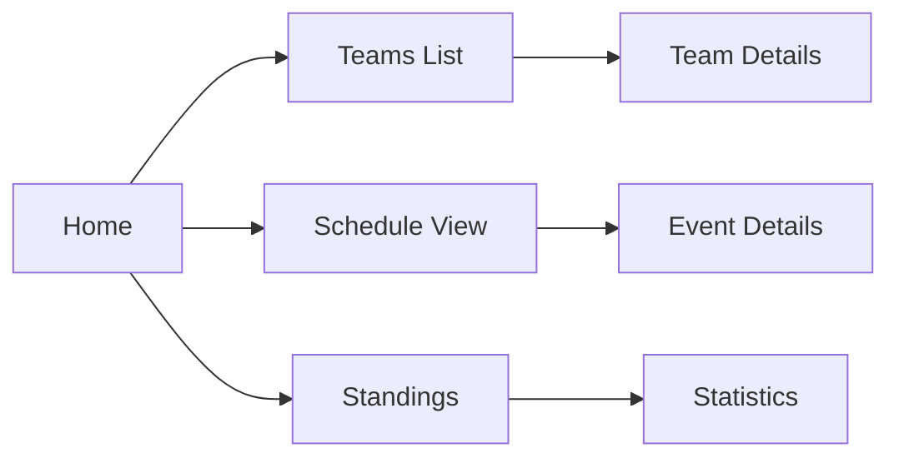
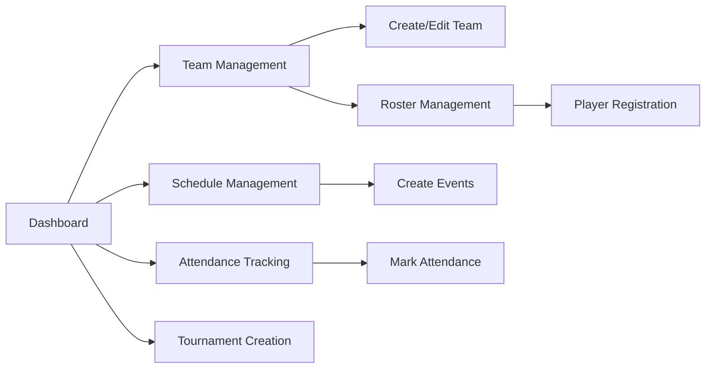
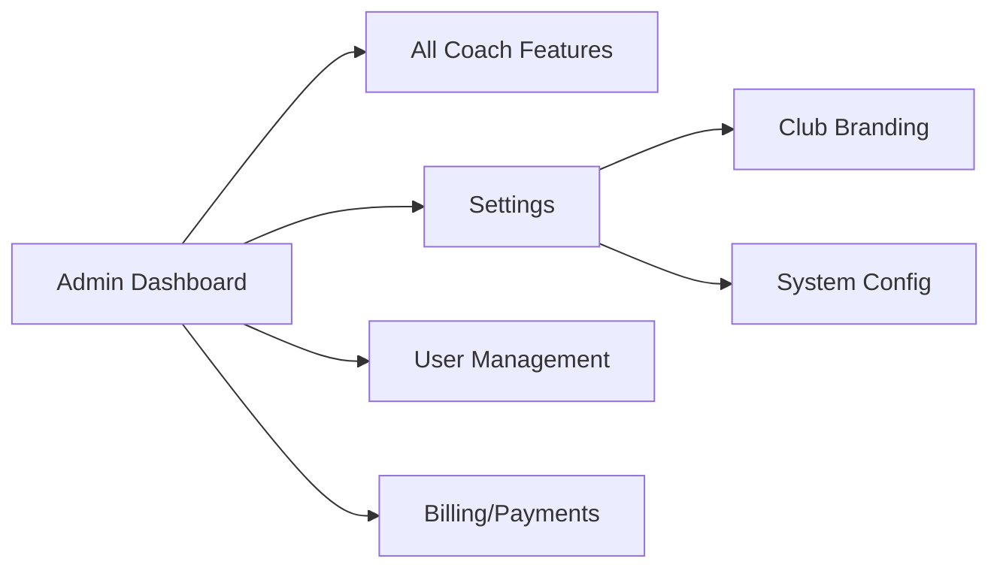

# TouchBase Navigation Map & User Flow

## 🗺️ Complete Site Navigation Tree

```
TouchBase/
│
├── 🏠 Dashboard (/)
│   ├── Quick Stats Overview
│   ├── Recent Activity Feed
│   └── Navigation to All Sections
│
├── ⚾ Teams (/teams)
│   ├── Team List View
│   ├── Create Team (/teams/create) [Auth Required]
│   └── Team Detail (/teams/{id})
│       └── Edit Team (/teams/{id}/edit) [Auth Required]
│
├── 👥 Roster (/roster)
│   ├── Player List
│   ├── Add Player [Modal/Form]
│   ├── Edit Player [Modal/Form]
│   └── Player Stats Integration
│
├── 📅 Schedule (/schedule)
│   ├── Calendar View
│   ├── List View
│   ├── Add Event [Modal/Form]
│   └── Event Detail View
│
├── ✅ Attendance (/attendance)
│   ├── Attendance Grid
│   ├── Mark Attendance
│   └── Attendance Reports
│
├── 📊 Statistics (/stats)
│   ├── Team Statistics
│   ├── Player Statistics
│   └── Season Summary
│
├── 🏆 Tournaments (/tournaments)
│   ├── Tournament List
│   ├── Create Tournament (/tournaments/create) [Auth Required]
│   └── Tournament Detail (/tournaments/{id})
│       ├── Bracket View
│       ├── Match Schedule
│       └── Results Entry
│
├── 🥇 Standings (/standings)
│   ├── League Table
│   ├── Head-to-Head Records
│   └── Statistical Leaders
│
├── 💬 AI Assistant (/ai/assistant)
│   ├── Chat Interface
│   ├── Coaching Suggestions
│   └── Data-Driven Insights
│
├── 📈 Analytics (Sprint 2)
│   ├── Team Analytics (/analytics/team)
│   └── Player Analytics (/analytics/player)
│
├── 👨‍👩‍👧 Parent Dashboard (/parent)
│   ├── Children Overview
│   ├── Upcoming Events
│   └── Performance Summary
│
└── ⚙️ Settings (/settings) [Admin Only]
    ├── Club Configuration
    ├── Branding Setup
    └── System Preferences
```

## 🔀 User Navigation Flows

### Public User Flow


### Authenticated Coach Flow


### Admin Flow


## 🌐 API Endpoints Structure

### Public API Routes
- `GET /api/health` - System health check
- `GET /api/teams` - List all teams
- `GET /api/teams/{id}` - Get team details
- `GET /api/schedule` - Get schedule
- `GET /api/standings` - Get standings
- `GET /api/stats` - Get statistics

### Protected API Routes (Auth Required)
- `POST /api/teams` - Create team
- `PUT /api/teams/{id}` - Update team
- `DELETE /api/teams/{id}` - Delete team
- `POST /api/roster` - Add player
- `POST /api/attendance` - Mark attendance
- `POST /api/tournaments` - Create tournament
- `POST /api/ai/chat` - AI chat interaction

### Widget Routes (Embeddable)
- `/widgets/schedule` - Embeddable schedule
- `/widgets/roster` - Embeddable roster
- `/widgets/attendance` - Embeddable attendance grid

## 🎨 Navigation Bar Structure

### Desktop Navigation
```
┌─────────────────────────────────────────────────────────────┐
│ [Logo] TouchBase | Teams | Roster | Schedule | Attendance |  │
│                    Stats | Tournaments | Standings |         │
│                    [💬 AI Assistant]  [EN] [ES]             │
└─────────────────────────────────────────────────────────────┘
```

### Mobile Navigation (Hamburger Menu)
```
┌──────────────┐
│ ☰ TouchBase  │
├──────────────┤
│ Dashboard    │
│ Teams        │
│ Roster       │
│ Schedule     │
│ Attendance   │
│ Stats        │
│ Tournaments  │
│ Standings    │
│ AI Assistant │
│ [EN] [ES]    │
└──────────────┘
```

## 🔐 Access Control Matrix

| Route | Public | Parent | Coach | Admin |
|-------|--------|--------|-------|-------|
| Dashboard | ✅ | ✅ | ✅ | ✅ |
| Teams List | ✅ | ✅ | ✅ | ✅ |
| Create Team | ❌ | ❌ | ✅ | ✅ |
| Edit Team | ❌ | ❌ | ✅ | ✅ |
| Roster View | ✅ | ✅ | ✅ | ✅ |
| Roster Edit | ❌ | ❌ | ✅ | ✅ |
| Schedule View | ✅ | ✅ | ✅ | ✅ |
| Schedule Edit | ❌ | ❌ | ✅ | ✅ |
| Attendance View | ❌ | ✅ | ✅ | ✅ |
| Attendance Mark | ❌ | ❌ | ✅ | ✅ |
| Statistics | ✅ | ✅ | ✅ | ✅ |
| Tournaments | ✅ | ✅ | ✅ | ✅ |
| Create Tournament | ❌ | ❌ | ✅ | ✅ |
| Standings | ✅ | ✅ | ✅ | ✅ |
| AI Assistant | ❌ | ✅ | ✅ | ✅ |
| Analytics | ❌ | ❌ | ✅ | ✅ |
| Parent Dashboard | ❌ | ✅ | ❌ | ✅ |
| Settings | ❌ | ❌ | ❌ | ✅ |

## 🌍 Internationalization

### Supported Languages
- **English (en)** - Default
- **Spanish (es)** - Full translation

### Language Switcher
- Available on all pages
- Persists selection in session
- Form-based POST to `/lang/switch`
- Redirects back to current page

## 📱 Responsive Breakpoints

- **Mobile**: < 768px (Single column, hamburger menu)
- **Tablet**: 768px - 1024px (Two columns, condensed nav)
- **Desktop**: > 1024px (Full layout, expanded navigation)

## 🎯 Key User Journeys

### 1. Coach Creating a Team
```
Dashboard → Teams → Create Team → Fill Form → Save → Team Detail
```

### 2. Parent Checking Child's Schedule
```
Parent Dashboard → Children → Select Child → Upcoming Events
```

### 3. Admin Setting Up Tournament
```
Tournaments → Create Tournament → Configure → Add Teams → Generate Bracket
```

### 4. Player Checking Statistics
```
Stats → Player Stats → Search Name → View Performance
```

### 5. Using AI Assistant
```
AI Assistant → Ask Question → Receive Coaching Insights → Apply Suggestions
```

## 🔧 Navigation Testing Coverage

### Playwright Tests Created
- ✅ Basic navigation flow
- ✅ Teams CRUD operations
- ✅ Protected route handling
- ✅ Mobile responsive navigation
- ✅ Language switching
- ✅ API endpoint health checks
- ✅ 404 error handling
- ✅ Session persistence
- ✅ Keyboard navigation
- ✅ Performance monitoring

### Test Commands
```bash
# Run navigation tests
npm run test:e2e tests/e2e/navigation-complete.spec.ts

# Run with UI mode for debugging
npm run test:e2e:ui

# Run specific test
npx playwright test -g "Complete User Navigation Tree"
```

## 📊 Navigation Metrics

### Expected Performance
- Page Load: < 3 seconds
- Navigation Transition: < 500ms
- API Response: < 1 second
- Mobile Menu Open: < 200ms

### Accessibility Standards
- All navigation items keyboard accessible
- ARIA labels on all nav elements
- Focus indicators visible
- Screen reader compatible
- Color contrast WCAG AA compliant